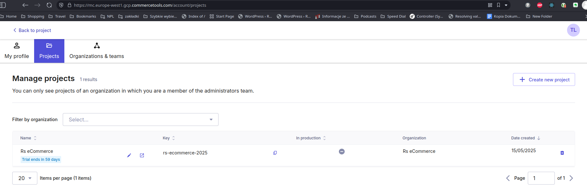
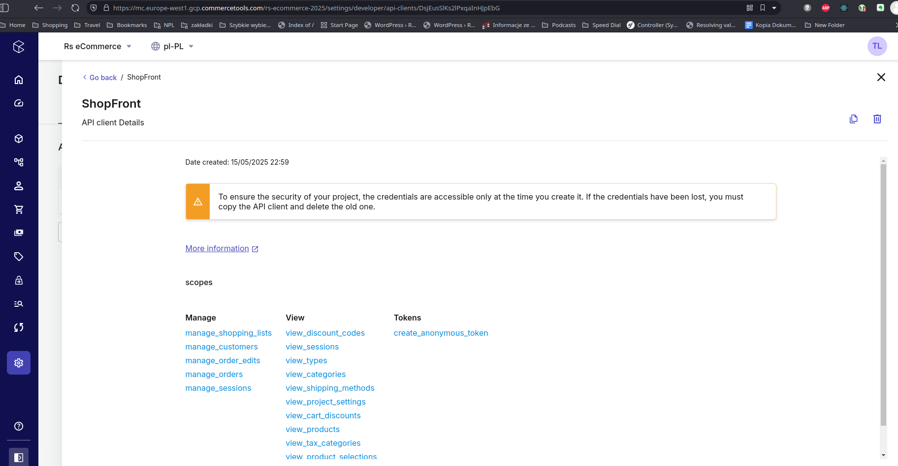

# E-Commerce-Application

A modern e-commerce application developed as part of the Rolling Scopes School project. Built using [your stack, e.g., TypeScript, React, CommerceTools, etc.].

## Trello board for task organization

https://trello.com/invite/b/682645cdc3926b174cfbce59/ATTI38de715cf2f853418c6eb3a515182df3DE372C23/ecommerce-application

## Commerce tools project

Commercetools project created under "Rs eCommerce" title

ShopFront API created in project
